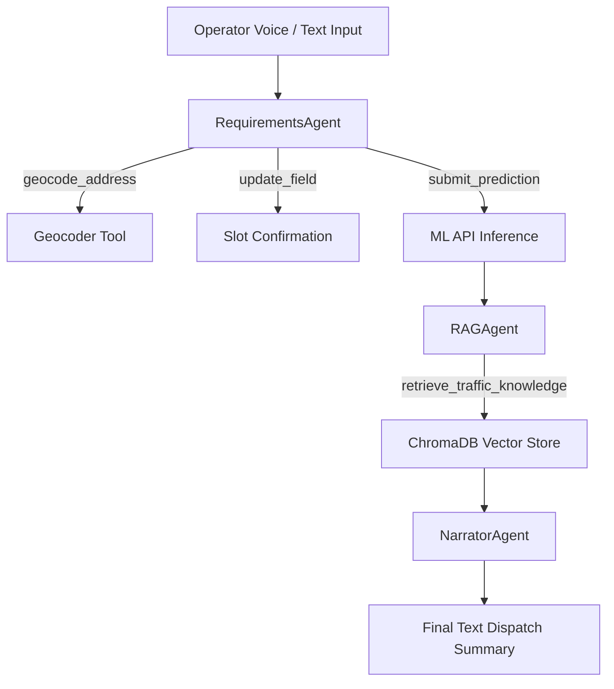

# ASTraM Voice Dispatch System Status & Agent Workflow Report

This document provides a technical assessment of the ASTraM Voice Dispatch system, confirming what is fully implemented versus what is simulated. It also details the integration of the **Google Agent Development Kit (ADK)** and the multi-agent workflow.

---

## 1. Architectural Reality Assessment

Here is the confirmation of the system architecture based on a detailed code audit of the local codebase:

### ✅ Real & Fully Implemented Components
*   **Web Speech API Transcription**: **100% Real.** The frontend (`useVoiceSession.ts`) utilizes the native browser `SpeechRecognition` / `webkitSpeechRecognition` to transcribe microphone inputs locally in Hindi, Kannada, or English.
*   **WebSocket Communication (Text-Based)**: **100% Real.** Raw text transcripts are sent as JSON payloads (`type: "voice_input"`) from the browser to the FastAPI WebSocket router (`websocket_bridge.py`) on port `7860`.
*   **Gemini Entity Extraction & Tool Calling**: **100% Real.** The backend passes the user transcript directly to a Gemini chat session. The model detects entity patterns and invokes python tools (`geocode_address`, `update_field`, `submit_prediction`) as function calls.
*   **Local Geocoding & Spatial Mapping**: **100% Real.** The `geocode_address` tool maps plain-text location descriptions (like "HAL Old Airport Road") to latitude/longitude and resolves the corresponding police station jurisdiction, zone, and corridor names.
*   **LightGBM + Neural Network Ensemble**: **100% Real.** The `submit_prediction` tool makes a local POST request to the inference server (`api.py`) on port `8000`, running the pre-trained LightGBM and Neural Network models to return resources deployment requirements.
*   **ChromaDB RAG**: **100% Real.** The database (`knowledge_base.py`) queries a local vector store with embedded traffic guidelines, returning specific detour and alternate route recommendations to the dispatcher.

### ⚠️ Gemini "Live" API vs. Standard Text chat
*   **The Verdict**: The system uses the model name `gemini-3.1-flash-live-preview`, but it connects to it using the standard **unary text-to-text chat API** (`genai_client.chats.create`) rather than Google's bidirectional WebSocket audio-in/audio-out Multimodal Live API.
*   **Implications**: This is a robust and standard pattern. Bidirectional audio streaming (sending raw binary PCM voice over WebSockets to Google) is not implemented. Web Speech API handles the speech-to-text conversion client-side, and Gemini processes it as text.

### 🔴 Simulated Narration
*   **The Verdict**: There is **no audio synthesis (TTS)** implemented in either the frontend or the backend. The dispatcher "narration" is represented entirely as text transcripts or logs (e.g. sending a text message containing `[REPLAYING LAST AUDIO SEGMENT]` when requested).

---

## 2. Google Agent Development Kit (ADK) Integration

The codebase integrates Google's **Agent Development Kit (ADK)** to declare the multi-agent blueprints in `voice_agent/agents.py`.

### How ADK is Configured
In `voice_agent/agents.py`, three agents are declared using the ADK `LlmAgent` abstraction:

1.  **RequirementsAgent**:
    *   **Model**: `gemini-3.1-flash-live-preview`
    *   **Role**: Converses with the operator to extract the 5 target fields.
    *   **Tools**: Configured with local Python tool functions (`geocode_address`, `update_field`, `submit_prediction`).
2.  **RAGAgent**:
    *   **Model**: `gemini-3-flash`
    *   **Role**: Receives the incident attributes and performs grounded vector database queries.
3.  **NarratorAgent**:
    *   **Model**: `gemini-3.1-flash-live-preview`
    *   **Role**: Prepares the final dispatch summary for operator feedback.

### ADK vs. Runtime Execution
*   **Blueprint Role**: The ADK code in `agents.py` acts as a declarative specification. It validates that the prompt structures, models, and tools conform to Google's multi-agent framework definitions.
*   **Runtime Execution**: The live ASGI WebSocket runtime (`websocket_bridge.py`) implements its chat routing logic directly using the standard `google-genai` SDK Client (`genai.Client`). This direct client integration is used to manage the low-level, async WebSocket read-write loop, parse raw function calls, and emit slot-filling updates directly to the frontend.

---

## 3. Multi-Agent Workflow Specification

The multi-agent workflow operates in a sequential pipeline described by the diagram below:

### Detailed Step-by-Step Workflow:

1.  **RequirementsAgent (Conversational Slot-Filler)**:
    *   Listens to incoming transcript chunks from the browser.
    *   Runs slot-filling loops. When the operator mentions a location, it invokes `geocode_address` to update coordinates and spatial attributes (corridor, station, zone).
    *   When the operator mentions an event type, cause, priority, or vehicle type, it invokes `update_field` to sync the state.
    *   If any fields are missing, it asks target questions (e.g. "What vehicle type was involved?").
2.  **ML Predictor (Resource Model)**:
    *   Once at least 3 fields are confirmed, the RequirementsAgent or user triggers `submit_prediction`.
    *   The backend posts the resolved incident payload to the inference engine (port `8000`) and resolves recommended officer counts, barricade requirements, and detour necessities.
3.  **RAGAgent (Retrieval)**:
    *   Upon receiving the prediction, the system queries the ChromaDB vector database with an contextual query.
    *   It retrieves localized traffic guidelines and populates the operational recommendations card on the UI.
4.  **NarratorAgent (Summary)**:
    *   Compiles the finalized prediction metrics, resolved locations, and RAG guidelines into a clean dispatch summary text log and updates the UI state to complete.

---

## 4. Preset Simulation vs. Live Mic Path

*   **Live Microphone Path**: **Fully Operational.** You can speak naturally into the microphone. Next.js transcribes it, pushes it over the WebSocket, and Gemini updates the slot fields in Zone C one-by-one.
*   **Demo Preset (`ORR Construction Closure`)**: This acts as a robust shortcut button for the demonstration. When clicked, it bypasses the voice parser and manually injects the exact attributes of a complex incident into the shared session state. This guarantees that the ML models (event impact score, manpower, barricades) and the ChromaDB RAG vector store return a complete response instantly without needing active voice inputs.
