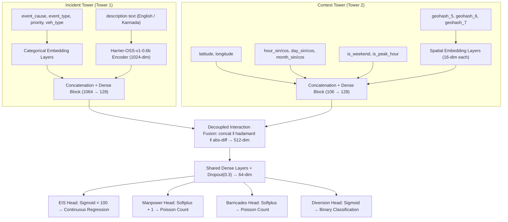

# Model Architecture — Two-Tower Dual Encoder with Gradient Boosting Ensemble

This document describes the complete machine learning and deep learning architecture constructed to forecast event-driven traffic congestion in the Bengaluru metropolitan region. The system simultaneously predicts the Event Impact Score (EIS), recommended officer deployment, barricade count, and binary diversion requirement from raw incident log entries.

## 1. Architectural Overview

The prediction system adopts a hybrid modeling paradigm, combining a deep spatio-temporal encoder with a gradient boosted decision tree baseline into a calibrated ensemble. The two constituent models are architecturally complementary: the neural encoder captures continuous, non-linear, and semantic signals from free-form text descriptions and cyclical temporal patterns, while the gradient booster specializes in high-cardinality categorical inputs and tabular count targets. Together they form a multi-task regression and classification system that is simultaneously interpretable at the feature level and expressive at the representation level.

## 2. Two-Tower Neural Network Architecture

The model is implemented in [models.py](file:///c:/Users/bhavy/Desktop/Kaam/Hackathon/Gridlock-flipkart/Gridlock%20Round%202/ps2/src/event_driven_congestion/models.py).

### Tower 1: Incident Encoder

The first tower processes the semantic and categorical properties of the incident itself, irrespective of where or when it occurred. Four categorical fields are projected into learned low-dimensional embedding spaces: `event_type` into a space of dimension 8, `event_cause` into dimension 16, `priority` into dimension 8, and `veh_type` into dimension 8. These embeddings are concatenated with a 1024-dimensional dense vector produced by the pre-trained `microsoft/harrier-oss-v1-0.6b` sentence encoder, which processes the raw free-form description written in English, Kannada, or mixed local register. The concatenated incident vector therefore has dimension:

$$\text{incident\_in\_dim} = 8 + 16 + 8 + 8 + 1024 = 1064$$

This vector passes through a feedforward block consisting of a linear projection from 1064 to 128 dimensions, a SELU non-linearity, a LayerNorm stabilization layer, a second linear projection from 128 to 128, and a final SELU activation. The output is the incident representation vector $\mathbf{u} \in \mathbb{R}^{128}$.

### Tower 2: Context Encoder

The second tower encodes the spatio-temporal environment in which the incident is embedded, capturing where and when the event occurred. Exact geographic coordinates (latitude and longitude) are passed as two raw continuous inputs. Multi-resolution geohash codes at precision levels 5, 6, and 7 are each embedded into 16-dimensional spaces, providing coarse-to-fine spatial locality representations. Administrative categorical identifiers — corridor, police station, and zone — are similarly embedded at 16 dimensions each. Six cyclical temporal features encoding hour-of-day, day-of-week, and month as sine-cosine pairs capture periodic traffic rhythms without discontinuity at boundary values. Two binary flags, `is_weekend` and `is_peak_hour`, encode known high-demand temporal regimes. The concatenated context vector has dimension:

$$\text{context\_in\_dim} = 2 + (16 \times 6) + 6 + 2 = 106$$

This vector passes through an identical feedforward structure to that of Tower 1, yielding the context representation vector $\mathbf{v} \in \mathbb{R}^{128}$.

### Decoupled Interaction Fusion

To model the complex non-linear interactions between incident semantics $\mathbf{u}$ and environmental context $\mathbf{v}$, the fusion module computes three complementary interaction signals. Concatenation $\mathbf{f}_\text{cat} = [\mathbf{u};\mathbf{v}] \in \mathbb{R}^{256}$ captures the joint representation. The Hadamard (element-wise) product $\mathbf{f}_\text{prod} = \mathbf{u} \odot \mathbf{v} \in \mathbb{R}^{128}$ captures component-wise co-activation, encoding which latent incident features align with latent contextual features. The absolute difference $\mathbf{f}_\text{diff} = |\mathbf{u} - \mathbf{v}| \in \mathbb{R}^{128}$ captures discordance between the two representations, which is informative when an incident type is atypical for a given location. The three signals are concatenated into the interaction representation:

$$\mathbf{h}_\text{fuse} = [\mathbf{f}_\text{cat};\, \mathbf{f}_\text{diff};\, \mathbf{f}_\text{prod}] \in \mathbb{R}^{512}$$

### Shared Representation and Multi-Task Prediction Heads

The fused vector $\mathbf{h}_\text{fuse}$ passes through shared hidden layers — Linear(512, 128), SELU, Dropout(0.3), Linear(128, 64), SELU — to produce the shared task-agnostic embedding $\mathbf{z} \in \mathbb{R}^{64}$. Four specialized prediction heads branch off $\mathbf{z}$ to form the system outputs. The EIS head applies a linear projection followed by Sigmoid scaled by 100, constraining the output to the continuous interval $[0, 100]$. The manpower head applies a linear projection followed by Softplus and a constant shift of $+1.0$, ensuring a minimum deployment of one officer and producing a Poisson-distributed count. The barricades head follows the same Softplus formulation without the constant shift. The diversion head applies a linear projection followed by Sigmoid, producing a calibrated probability of diversion requirement in $[0, 1]$.

## 3. Loss Formulation and Optimization Strategy

### Unified Multi Task Loss

The total loss is minimized jointly across all four targets using weighted aggregation:

$$\mathcal{L}_\text{total} = \mathcal{L}_\text{EIS} + 2.0 \cdot \mathcal{L}_\text{manpower} + 2.0 \cdot \mathcal{L}_\text{barricades} + \mathcal{L}_\text{diversion}$$

The EIS target is supervised with Huber Loss (delta = 1.0) which provides robustness to outlier values. The manpower and barricades targets are supervised with Poisson Negative Log Likelihood Loss which is the natural likelihood for non negative integer count data. The diversion target is supervised with standard Binary Cross Entropy Loss.

### Optimization Protocol

Training uses the AdamW optimizer with an initial learning rate of 0.0007 and weight decay of 0.0001. A Cosine Annealing learning rate schedule decays the learning rate over 25 epochs to a minimum of 0.000001. Early stopping with a patience of 8 epochs halts training if validation loss does not improve, and the best checkpoint for each fold is saved to the models directory.

## 4. Class Imbalance Handling: Diversion Target

The diversion label is defined operationally as any incident requiring road closure or having an Event Impact Score exceeding 60. This yields a natural class imbalance of approximately 3.94 to 1 in the negative to positive direction.

Through empirical testing, it was discovered that training the neural network diversion head with biased loss formulations (such as Focal Loss or weighted Binary Cross Entropy Loss) degraded the shared latent representation. Specifically, the strong gradients backpropagating from the weighted classification head dominated the multitask optimization, reducing the R squared score of the manpower regression task from 0.655 to 0.595.

To resolve this multitask trade off, the neural network diversion head is trained using standard unweighted Binary Cross Entropy. This choice preserves the stability of the shared layers, allowing the network to achieve optimal performance on all tasks simultaneously, including a manpower regression R squared score of 0.689.

The class imbalance is instead addressed through two distinct mechanisms. First, the LightGBM diversion classifier is optimized using the scale pos weight hyperparameter, which multiplies the gradient contributions of positive class samples by the negative to positive ratio (approximately 3.94) calculated per fold. Second, the predictions are combined via a calibrated ensemble where the LightGBM classifier receives a 70 percent weight and the neural network receives a 30 percent weight, evaluated at the standard 0.50 threshold. This combination achieves an F1 score of 0.784 and recall of 0.767, which represents a significant improvement over the baseline.

### Improved Cross Validation Stratification

The stratification key concatenates the EIS quantile bin, event cause, and the binary diversion label, explicitly ensuring that the diversion positive minority is uniformly distributed across all five folds. This modification prevents pathological folds in which a model fold is trained on predominantly non diversion examples.

## 5. LightGBM Gradient Boosting Baseline

The tabular gradient boosting baseline is trained separately on the full feature set used by the neural network, excluding geohash columns and including the 1024 dimensional description embeddings as explicit tabular features. The feature matrix has dimensionality 1041. Five fold out of fold training uses the same stratified folds as the neural network, with early stopping on the validation set with a patience of 20 rounds.

Regression targets use LGBMRegressor with Poisson objective for count targets. The diversion target uses LGBMClassifier with scale pos weight, trained with 800 estimators at a learning rate of 0.04 and 31 maximum leaves.

## 6. Ensemble Blending Strategy

The final prediction for each target is computed as a convex combination of the neural network and LightGBM out of fold predictions, with weights calibrated to the relative strength of each model.

* EIS: 0.40 neural network weight and 0.60 LightGBM weight. LightGBM achieves marginally better root mean squared error on the tabular heavy EIS regression.
* Manpower: 0.10 neural network weight and 0.90 LightGBM weight. LightGBM dominates the discrete Poisson count target with an R squared score of 0.867.
* Barricades: 0.50 neural network weight and 0.50 LightGBM weight. Both models achieve comparable R squared score on the barricades target.
* Diversion: 0.30 neural network weight and 0.70 LightGBM weight. Blending the scale pos weight optimized LightGBM classifier with the standard unweighted neural network yields the highest overall F1 score of 0.784 and recall of 0.767 at the standard 0.50 threshold.

## 7. Validation and Observability

The training pipeline uses 5 Fold Stratified Cross Validation, with fold stratification based on EIS quantile bin, event cause, and diversion label. All training metrics are logged simultaneously to the terminal and to the train log. Final evaluation metrics are written to the run summary log.
